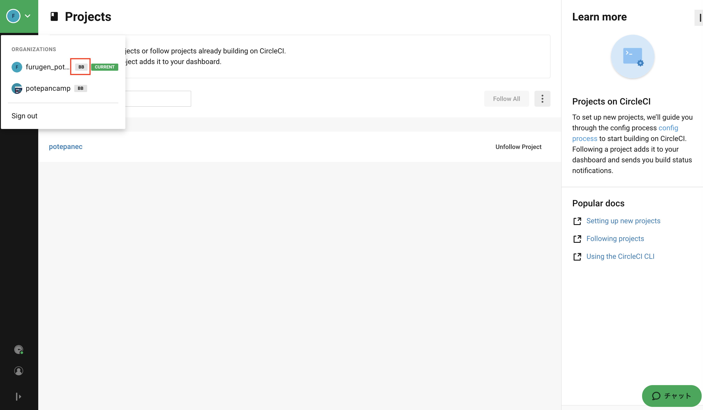
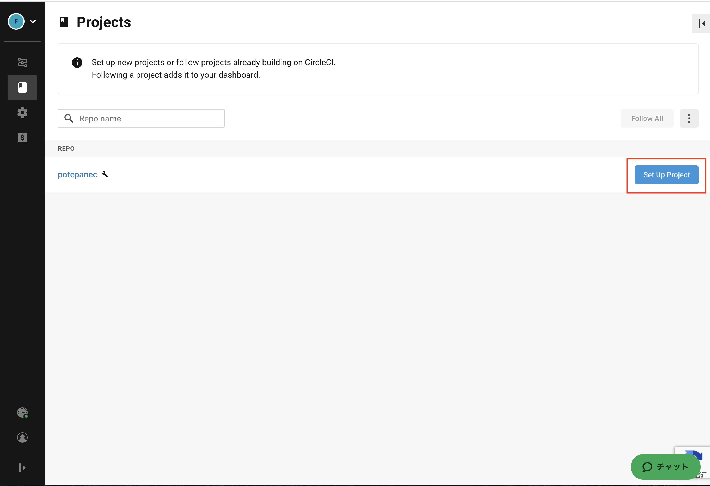
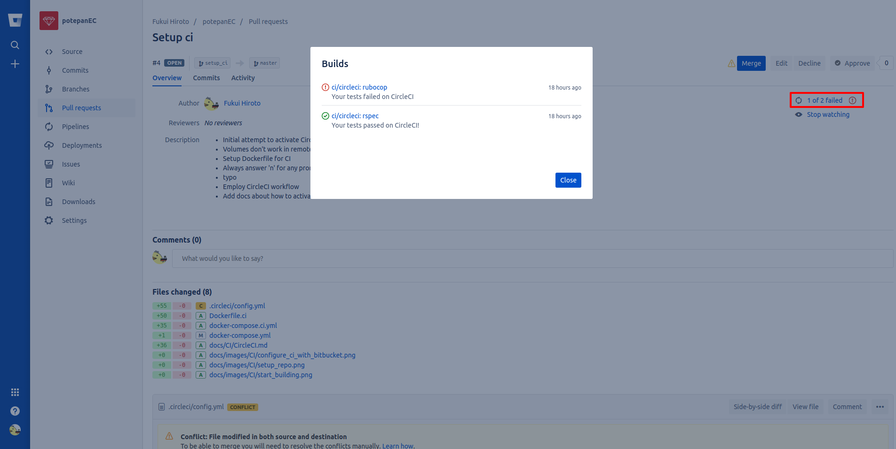
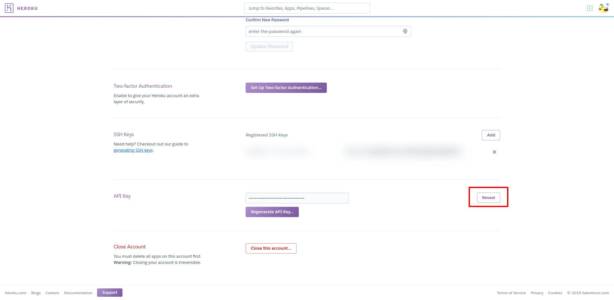
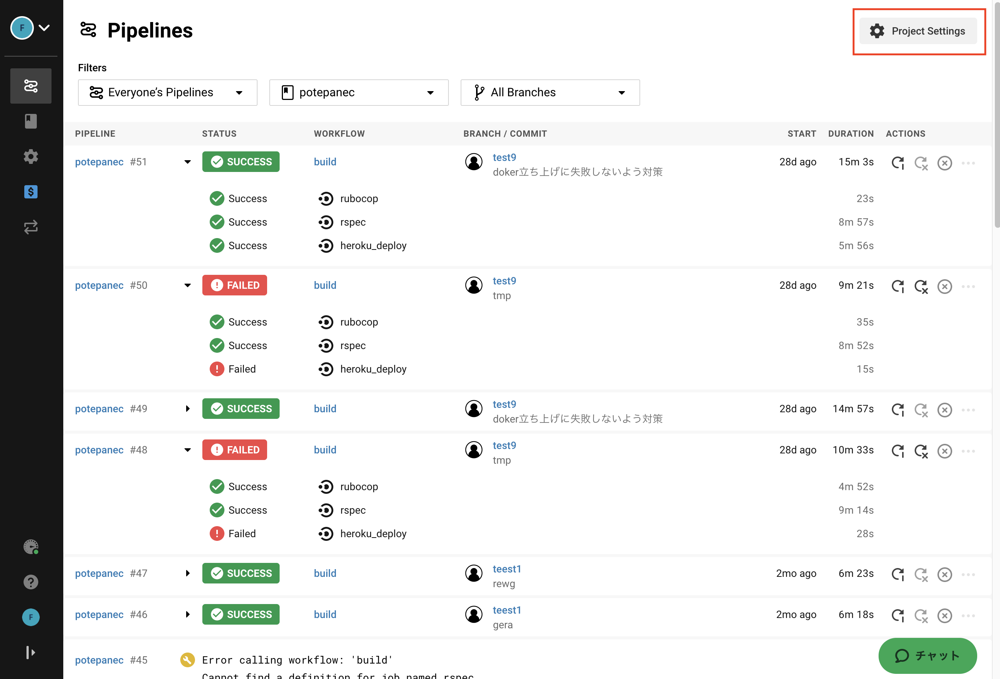
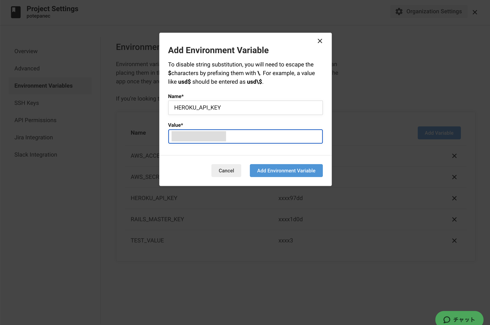

# CircleCI設定手順
ここではCircleCI上でRSpec、およびRubocopを実行させるまでの手順を説明します。

# ゴール
- ローカルcommitをremoteブランチにpushする度にCIが起動すること
- CIはすべての種類のRSpec、およびRubocopを実行すること
- 実行結果はそのブランチのPull Request上で閲覧できること
- 全てのテストをパスすると、アプリがHerokuにデプロイされること

# Bitbucketとの連携
BitbucketとCircleCIを連携させるための設定を行います。

まずは以下のURLにアクセスし、Bitbucket連携でSign Upしましょう。
https://circleci.com/signup/

画面左上のドロップダウンメニューにBitbucketのアイコンが付いたアカウント名が表示されていればOKです。

次にpotepanecレポジトリをCIのビルド対象に追加する設定を行います。
画面左の`Add Projects`から、potepanecレポジトリ横にある`Set Up Project`を選択します。

potepanecレポジトリの`.circleci/config.yml`が読み込まれていることを確認し、次のステップに進むために`Start Building`を選択します。

CircleCIが`.circleci/config.yml`に記載された手順に従ってビルドを開始する様子が確認できたでしょうか?

Pull Request を作成すると、CIの実行結果が画面上で確認できます。

### 補足: `.circleci/config.yml`が見つからない方へ
forkした時期によってはこのファイルがまだ追加されていない可能性があります。

もしファイルが見つからない方は[最新の本家potepanecレポジトリ](https://bitbucket.org/potepancamp/potepanec/src/master/)から対象のファイルをコピーして、ご自身のレポジトリに追加してください。
追加する際は必ずルートディレクトリ配下に`.circleci/config.yml`という名前で保存するように注意してください。

# Herokuデプロイの準備
## 前提
[ローカルからHerokuにデプロイする設定](../deploy/heroku.md)を先に完了させておいてください。
CicleCIからHerokuにデプロイする前に、まずはローカルからHerokuにデプロイ出来るようにする必要があります。

# 手順
ここではCirckeCIでテストが通った後、自動的にHerokuにデプロイするための設定を行います。

まずCircleCIにHerokuの認証情報を追加しましょう。

HerokuのWebページにログインし、右上の自分のアイコンから`Account settings`を選択します。

`API Key`セクションにある`Reveal`ボタンをクリックすると表示されるトークンをコピーしておきます。

続いて、CircleCI上でPipelines画面の右上にある歯車アイコンをクリックします。

左メニューから`Environment Variable`を選択し、`Add Variables`ボタンをクリックするとポップアップが表示されます。

`Name`に`HEROKU_API_KEY`、`Value`に先ほどコピーしたHerokuのAPI Keyを入力し、`Add Variable`をクリックします。

次に[ローカルからHerokuにデプロイする設定](../deploy/heroku.md)で取得したAWSの認証情報を追加します。

同じようにCircleCIの歯車アイコンから`Add Variables`を選択し、`AWS_ACCESS_KEY_ID`, `AWS_SECRET_ACCESS_KEY`、という名前でそれぞれ環境変数を追加します。

以上で設定は完了です!

これでCircleCIからHerokuにデプロイする準備が整いました。
